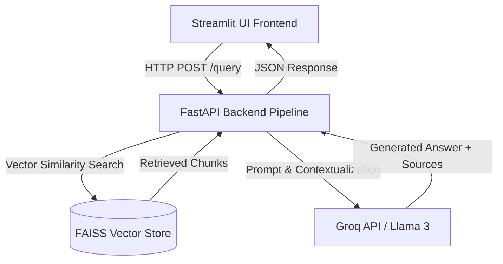

# 🐴 NeoHorse-1: Enterprise RAG System

A production-ready **Retrieval-Augmented Generation (RAG)** solution built with a decoupled architecture featuring a **FastAPI** backend and an interactive **Streamlit** UI.

---

## 🏗 System Architecture



---

## 🛠 Tech Stack

| Component | Technology |
| :--- | :--- |
| **Frontend** | Streamlit, Requests |
| **Backend** | FastAPI, Uvicorn, Pytest |
| **Vector Database** | FAISS |
| **Embeddings** | HuggingFace (`all-MiniLM-L6-v2`) |
| **LLM Orchestration** | LangChain, Groq API (`llama-3.1-8b-instant`) |

---

## 📂 Project Structure

```text
rag-graduation-project/
├── backend/
│   ├── app/
│   │   ├── __init__.py
│   │   ├── main.py
│   │   └── rag_engine.py
│   ├── tests/
│   │   ├── test_main.py
│   │   └── test_query.py
│   ├── .env.example
│   └── requirements.txt
├── frontend/
│   ├── api_client.py
│   ├── app.py
│   ├── .env.example
│   └── requirements.txt
├── notebooks/
│   └── rag_pipeline.ipynb
├── conftest.py
├── README.md
└── .gitignore
```

---

## 🚀 Setup & Installation

### 1. Backend Setup
```bash
cd backend
python -m venv .venv
.venv\Scripts\activate
pip install -r requirements.txt
uvicorn app.main:app --reload
```

### 2. Frontend Setup
```bash
cd frontend
streamlit run app.py
```

### 3. Run Automated Tests
```bash
python -m pytest backend/tests/test_query.py
```

---

## 📡 API Endpoints

| Method | Endpoint | Description |
| :--- | :--- | :--- |
| `GET` | `/health` | Returns system operational status. |
| `POST` | `/query` | Accepts JSON `{"question": "..."}` and returns answer with sources. |

---

## 🎥 Video Demonstration

👉 **[Click Here to Watch Full Live Demo Video](https://drive.google.com/file/d/1NBeAWyHYKRcFoQ0fb4yqRB74vWiUIEy5/view?usp=sharing)**